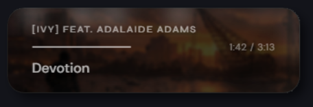
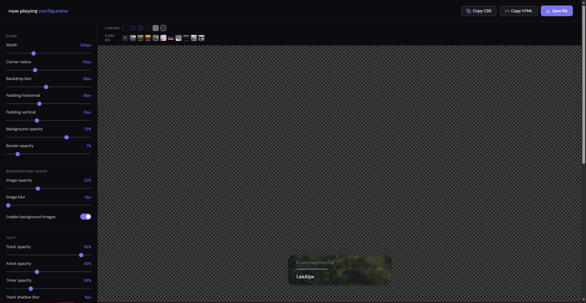

# foobar2000 Now Playing Overlay

A clean, minimal OBS browser source overlay that shows your currently playing track in foobar2000. Displays artist, track title, and a play timer inside a frosted-glass card with a real-time audio spectrum visualizer on the border. Optionally crossfades through a folder of background images on every track change.

[](https://youtu.be/GIjEJSzIUnQ)

---

## Requirements

- [foobar2000](https://www.foobar2000.org/) (any recent version)
- [Beefweb Remote Control](https://github.com/hyperblast/beefweb) — the foobar2000 component that exposes an HTTP API. Install it via foobar's component manager or grab the latest release from GitHub.
- **Python 3.8+** — for the spectrum visualizer server (optional, see below)

### Visualizer dependencies (optional)

The border visualizer requires a small Python script that captures your audio and streams FFT data to the overlay. If you don't want the visualizer, skip this step and comment out the spectrum server line in `serve.bat`.

```
pip install sounddevice numpy scipy websockets
```

---

## Setup

### 1. Beefweb

After installing Beefweb, open foobar2000 and go to **Preferences → Tools → Beefweb Remote Control**. The default port is `8880` — leave it as is unless something else on your machine is already using it. Make sure **Allow remote connections** is checked.

### 2. File structure

Put everything in the same folder, wherever you like:

```
📁 your folder
   nowplaying-overlay.html
   serve.bat
   overlay-server.ps1
   spectrum-server.py
   📁 bg
      image1.jpg
      image2.jpg
      ...
```

The `bg` folder is optional. `spectrum-server.py` is only needed if you want the visualizer.

### 3. Configure the spectrum server (optional)

Open `spectrum-server.py` and set `DEVICE` to match your audio input device:

```python
DEVICE = 'Line 1'  # partial name match is fine
```

Run `python spectrum-server.py --list` to see all available devices. You want the **capture** end of your VAC cable — the one that receives audio from foobar.

If you don't want the visualizer, open `serve.bat` and comment out the spectrum server line:

```bat
@echo off
REM start /min "Spectrum Server" python "%~dp0spectrum-server.py"
start /min "Overlay Server" powershell -NoProfile -ExecutionPolicy Bypass -File "%~dp0overlay-server.ps1"
```

Also set `VISUALIZER: false` in `nowplaying-overlay.html`.

### 4. Start the servers

Double-click `serve.bat`. Both servers launch minimized to the taskbar automatically.

> **Tip:** Create a shortcut to `serve.bat` and prefix the target with `cmd /c` to enable pinning it to the Start Menu.

### 5. OBS browser source

Add a Browser Source in OBS and point it at:

```
http://localhost:8081/nowplaying-overlay.html
```

Set the background colour to transparent (RGBA 0,0,0,0). Width and height can be whatever fits your layout — the card sizes itself to its content and sits in the top-left corner.

---

## Background images

Drop any images into the `bg` folder — they're picked up automatically, no config needed. On every track change the overlay crossfades to a randomly picked image. Once all images have been shown it reshuffles and starts again.

Supported formats: `jpg`, `jpeg`, `png`, `webp`, `avif`

To disable background images entirely, open `nowplaying-overlay.html` and set:

```js
IMAGES: false,
```

### What looks good

The image sits behind the text at reduced opacity, so busy photos tend to look noisy. What works well:

- Gradient skies — sunsets, golden hour, dusk
- Minimalist landscapes with a strong horizon line
- Abstract or bokeh shots — already soft, very forgiving
- Anything with big areas of solid-ish colour

Avoid heavily detailed photos (dense forests, city skylines at night) unless you're running with blur enabled — they turn into visual noise. [Unsplash](https://unsplash.com) and [Pexels](https://www.pexels.com) are good sources, and both let you filter by colour to match your stream palette.

**Recommended image dimensions:** wide and short — around `1200×300px` or similar. Square and portrait images work but lose a lot to cropping since the card is much wider than it is tall.

---

## Configuration

### JavaScript (`CONFIG` block near the top of the HTML)

| Option | Default | Description |
|--------|---------|-------------|
| `ENDPOINT` | `http://localhost:8081/api/...` | The Beefweb proxy URL. Only change this if you've changed Beefweb's port in its preferences (update `8880` in `overlay-server.ps1` to match). |
| `POLL_MS` | `1000` | How often the overlay checks foobar for updates, in milliseconds. 1000 = once per second. |
| `DEMO_MODE` | `false` | Set to `true` to preview the overlay with fake rotating tracks — useful when foobar isn't running. |
| `IMAGES` | `true` | Set to `false` to disable background images. |

### CSS variables (`:root` block near the top of the HTML)

#### Card shape

| Variable | Default | Description |
|----------|---------|-------------|
| `--card-bg` | `rgba(10,10,14,0.72)` | Background colour of the card. Adjust the last value (0.72) for more or less transparency. |
| `--card-blur` | `28px` | Backdrop blur — the frosted glass effect behind the card. |
| `--card-radius` | `20px` | Corner radius. Higher = rounder. `60px`+ gives a full pill shape. |
| `--card-border` | `rgba(255,255,255,0.07)` | Subtle border around the card. |
| `--card-min-width` | `320px` | Minimum width of the card. |
| `--card-padding-x` | `28px` | Left/right inner padding. |
| `--card-padding-y` | `18px` | Top/bottom inner padding. |

#### Background images

| Variable | Default | Description |
|----------|---------|-------------|
| `--img-opacity` | `0.22` | How visible the background image is. `0.15–0.30` is the sweet spot — below that it's barely there, above it starts competing with the text. |
| `--img-blur` | `0px` | Extra blur applied to the image. `0px` keeps it sharp. Crank it up if you want a softer, more abstract look. |
| `--img-scale` | `1.06` | Slight zoom to prevent blurred edges from peeking through during the crossfade. Only relevant if `--img-blur` is greater than `0`. |

#### Text colours

All text colours are white with varying opacity. Adjust the last value to change intensity.

| Variable | Default | Description |
|----------|---------|-------------|
| `--color-track` | `rgba(255,255,255,0.92)` | Track title — the main text, kept close to full white. |
| `--color-artist` | `rgba(255,255,255,0.42)` | Artist name — intentionally dimmer than the title. |
| `--color-timer` | `rgba(255,255,255,0.35)` | Playback timer — the most subtle of the three. |

#### Text shadows

The shadows are hardcoded in the CSS rather than variables, but they're easy to find and adjust. Search for `text-shadow` in the file — there are three instances (artist, timer, track). The format is:

```css
text-shadow: 0 1px 6px rgba(0,0,0,0.7);
```

The third value is the blur radius (how spread out the shadow is) and the last value is the opacity. Increase the blur radius for a softer glow, or increase the opacity to make text pop more against bright backgrounds.

#### Progress bar

| Variable | Default | Description |
|----------|---------|-------------|
| `--color-bar-bg` | `rgba(255,255,255,0.10)` | The unfilled portion of the progress bar. |
| `--color-bar-fill` | `rgba(255,255,255,0.50)` | The filled portion. |

---

## Behaviour notes

- The overlay hides itself automatically when foobar is closed or nothing is playing.
- A paused track keeps the overlay visible — the timer just stops moving.
- Track title and artist fade out briefly on track change, then fade back in with the new info.
- Background images crossfade over ~0.9 seconds, triggered by track changes.
- If the `bg` folder is empty the overlay works fine, just without images.
- The server (`overlay-server.ps1`) is entirely local — no internet connection involved.

---

## Visualizer

The overlay includes a real-time audio spectrum visualizer — frequency bands drawn around the inside of the card border, driven by actual FFT data from your audio device. It looks like a soft, organic glow that reacts to individual frequency bands rather than just overall volume.

### How it works

A small Python script (`spectrum-server.py`) captures audio from your VAC cable, computes a real FFT using numpy/scipy, and streams 64 frequency bands over a local WebSocket to the overlay at ~30fps. The overlay draws them as blurred bars around the card border.

### Requirements

```
pip install sounddevice numpy scipy websockets
```

### Setup

1. Put `spectrum-server.py` in the same folder as `serve.bat`
2. Open `spectrum-server.py` and set `DEVICE` to match your audio input device name (partial match is fine):
   ```python
   DEVICE = 'Line 1'
   ```
   Run `python spectrum-server.py --list` to see all available devices.
3. Open `nowplaying-overlay.html` and make sure:
   ```js
   VISUALIZER:     true,
   SPECTRUM_PORT:  9001,
   ```
4. `serve.bat` launches both servers automatically — no separate step needed.

Set `VISUALIZER: false` to disable it entirely.

### Spectrum server config

Open `spectrum-server.py` and adjust these values at the top:

| Option | Default | Description |
|--------|---------|-------------|
| `PORT` | `9001` | WebSocket port the overlay connects to |
| `DEVICE` | `'Line 1'` | Partial name of your audio input device |
| `BANDS` | `64` | Number of frequency bands |
| `CHUNK` | `1024` | Audio buffer size — smaller = snappier transient response |
| `SMOOTHING` | `0.5` | Band smoothing — lower = more reactive |
| `GAIN` | `6.0` | Amplification — increase if bars are too quiet |
| `FREQ_MIN` | `40` | Lowest frequency to analyse (Hz) |
| `FREQ_MAX` | `16000` | Highest frequency to analyse (Hz) |

### Overlay visualizer config

| Option | Default | Description |
|--------|---------|-------------|
| `VIS_COLOR` | `'255, 255, 255'` | RGB color of the bars |
| `VIS_MAX_OPACITY` | `0.81` | Peak brightness of the bars |
| `VIS_BAR_DEPTH` | `24` | How far bars reach inward from the border in px |
| `VIS_BLUR` | `10` | Canvas blur — higher = more glow, lower = more defined bars |
| `VIS_SMOOTHING` | `0.27` | Client-side smoothing — lower = snappier |
| `VIS_BANDS` | `63` | Number of bands to display (resampled from server bands) |

---

## Configurator

A visual GUI for tweaking all overlay settings without manually editing CSS is included as `configurator.html`. Open it in any browser, adjust sliders, preview live, then use **Save file** to download a ready-to-use overlay with your settings baked in. Includes a **Pull from file** button to import settings from an existing overlay HTML.

> **Note:** The configurator does not cover visualizer settings — fill those in manually in the HTML after saving, and remember to fill in your `SPECTRUM_PORT`.



---

## Ports

| Port | Used for |
|------|----------|
| `8880` | Beefweb (foobar2000 API) |
| `8081` | Overlay server (what OBS connects to) |
| `9001` | Spectrum server (visualizer data) |

If any port conflicts with something else on your machine, `8880` can be changed in Beefweb's preferences and `overlay-server.ps1`, `8081` in both `overlay-server.ps1` and the `ENDPOINT` in the HTML, and `9001` in both `spectrum-server.py` and `SPECTRUM_PORT` in the HTML.

